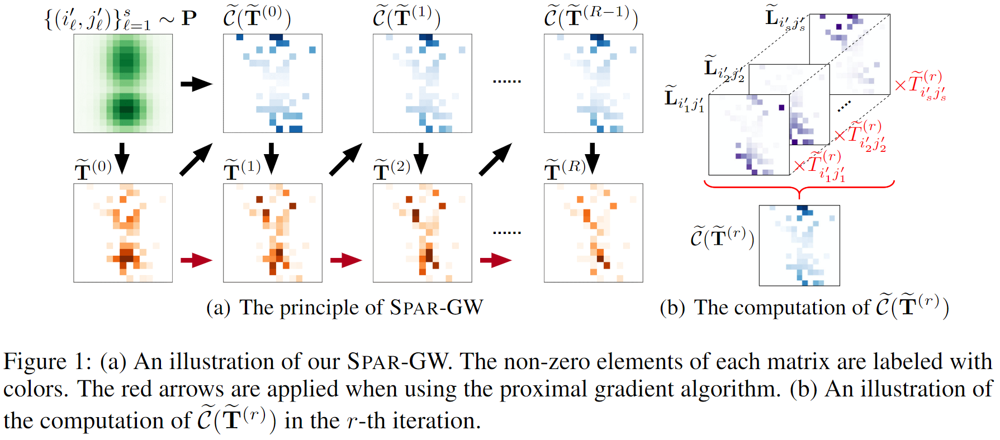

# Efficient Approximation of Gromov-Wasserstein Distance Using Importance Sparsification
This repository includes the implementation of our work **"Efficient Approximation of Gromov-Wasserstein Distance Using Importance Sparsification"** [https://doi.org/10.1080/10618600.2023.2165500].



If you use this toolbox in your research and find it useful, please cite:
```
@article{li2023efficient,
author = {Mengyu Li and Jun Yu and Hongteng Xu and Cheng Meng},
title = {Efficient Approximation of Gromov-Wasserstein Distance Using Importance Sparsification},
journal = {Journal of Computational and Graphical Statistics},
volume = {0},
number = {ja},
pages = {1-25},
year  = {2023},
publisher = {Taylor & Francis},
doi = {10.1080/10618600.2023.2165500},
URL = {https://doi.org/10.1080/10618600.2023.2165500}
}
```


## Introduction
A brief introduction about the folders and files:
* `setup/`: configuration files;
* `methods/`: the proposed method and baselines;
    * `LRGW/`: implementation of LR-GW for approximating GW;
    * `SGWL/`: implementation of S-GWL for approximating GW;
    * `gromov_funcs.py`: implementation of EGW-based methods (EGW, PGA-GW, and EMD-GW), AE, SaGroW, and **Spar-GW** for approximating GW (and FGW);
    * `unbalanced_gromov_funcs.py`: implementation of EUGW, PGA-UGW, SaGroW, and **Spar-UGW** for approximating UGW.
* `results/`: precomputed results;
    * `SYNTHETIC_dist_mat_spargw.mat`: a precomputed FGW distance matrix of the SYNTHETIC dataset, approximated by Spar-GW.
* `data_simulators.py`: generates the used synthetic datasets, i.e., "Moon", "Graph", "Gaussian", or "Spiral".
* `demo_gw_distance.ipynb`: an example of approximating the GW distance using different methods.
* `demo_graph_analysis.ipynb`: an example of graph clustering and graph classification.


## Requirements
Python: 3.10.8

You can create and activate the environment by running the following command:

    conda create -n newenv python=3.10
    conda activate newenv

Please run the following command under the `setup/` path to install the required packages:
    
    pip install -r requirements.txt
    pip install torch_sparse-0.6.15-cp310-cp310-win_amd64.whl
    pip install torch_scatter-2.0.9-cp310-cp310-win_amd64.whl


## Reproducibility
For synthetic data analysis in Section 6.1,
* you can run `demo_gw_distance.ipynb` to reproduce the results in Figure 2.

For real-world applications in Section 6.2,
* you can run `demo_graph_analysis.ipynb` to reproduce the results in Tables 2 and 3. Considering that computing a FGW distance matrix takes dozens of minutes (or even several hours), we provide a precomputed FGW distance matrix in `results/`. You can use the precomputed result directly via setting `use_precompute_dist = True` to do the tasks of graph clustering and graph classification.


## Main References
Kerdoncuff, Tanguy, Rémi Emonet, and Marc Sebban. "[Sampled Gromov Wasserstein](https://github.com/Hv0nnus/Sampled-Gromov-Wasserstein)." Machine Learning 110(8): 2151-2186, 2021.

Rémi Flamary, Nicolas Courty, Alexandre Gramfort, Mokhtar Z. Alaya, Aurélie Boisbunon, Stanislas Chambon, Laetitia Chapel, Adrien Corenflos, Kilian Fatras, Nemo Fournier, Léo Gautheron, Nathalie T.H. Gayraud, Hicham Janati, Alain Rakotomamonjy, Ievgen Redko, Antoine Rolet, Antony Schutz, Vivien Seguy, Danica J. Sutherland, Romain Tavenard, Alexander Tong, and Titouan Vayer. "[POT Python Optimal Transport library](https://pythonot.github.io/)." Journal of Machine Learning Research 22(78): 1-8, 2021.

Scetbon, Meyer, Gabriel Peyré, and Marco Cuturi. "[Linear-time Gromov Wasserstein distances using low rank couplings and costs](https://github.com/meyerscetbon/LinearGromov)." International Conference on Machine Learning. PMLR, 2022.

Séjourné, Thibault, François-Xavier Vialard, and Gabriel Peyré. "[The unbalanced Gromov Wasserstein distance: Conic formulation and relaxation](https://github.com/thibsej/unbalanced_gromov_wasserstein)." Advances in Neural Information Processing Systems 34: 8766-8779, 2021.

Xu, Hongteng, Dixin Luo, and Lawrence Carin. "[Scalable Gromov-Wasserstein learning for graph partitioning and matching](https://github.com/HongtengXu/s-gwl)." Advances in Neural Information Processing Systems 32: 3052-3062, 2019.